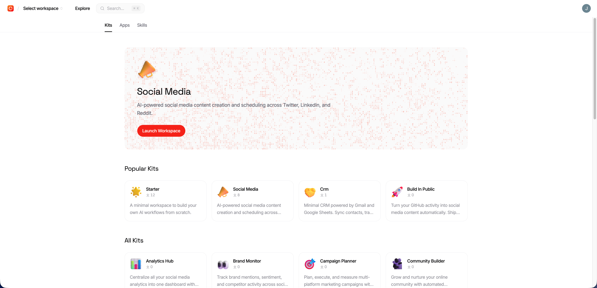
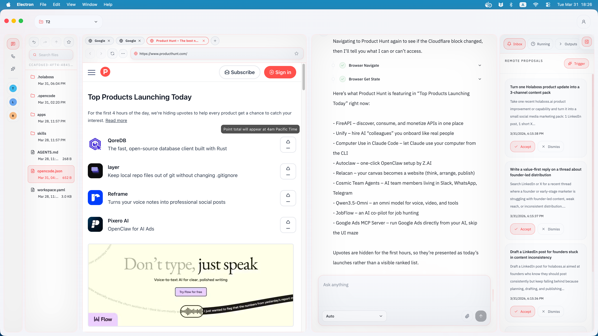

# Holaboss - AI Worker Desktop for Business

<p align="center">
  
</p>

<p align="center"><strong>Build, run, and package AI workers with a desktop workspace and portable runtime.</strong></p>

<p align="center">
  <a href="https://github.com/holaboss-ai/hola-boss-oss/actions/workflows/oss-ci.yml"></a>
  
  
  
  
  
</p>

<p align="center">
  <a href="https://holaboss.ai">Website</a> ·
  <a href="https://docs.holaboss.ai">Docs</a> ·
  <a href="https://app.holaboss.ai/signin">Sign in</a> ·
  <a href="#getting-started">Getting Started</a>
</p>

Holaboss enables you to build AI workers that go beyond one-off task execution—they operate continuously, taking initiative to drive real business outcomes. You can easily manage and coordinate multiple AI workers, each with its own dedicated workspace tailored to specific roles and responsibilities. These work environments are fully portable, meaning the AI workers you train—along with their context, tools, and skills—can be packaged and shared with others, unlocking true scalability and collaboration.

## Marketplace Experience

<p align="center">
  <a href="https://holaboss.ai">
    
  </a>
</p>

## Desktop Workspace

<p align="center">
  
</p>

## Table of Contents

- [Marketplace Experience](#marketplace-experience)
- [Desktop Workspace](#desktop-workspace)
- [Getting Started](#getting-started)
  - [Prerequisites](#prerequisites)
  - [One-Line Agent Setup](#one-line-agent-setup)
  - [Quick start](#quick-start)
- [Workspace Structure](#workspace-structure)
- [AI Labour Market](#ai-labour-market)
- [Capability Hub](#capability-hub)
  - [Apps and Integrations](#apps-and-integrations)
  - [Skills and MCP](#skills-and-mcp)
- [Hosted Features](#hosted-features)
  - [What works in OSS](#what-works-in-oss)
  - [What may require Holaboss backend access](#what-may-require-holaboss-backend-access)
- [Technical Details](#technical-details)
  - [Repository layout](#repository-layout)
  - [Common commands](#common-commands)
  - [Development notes](#development-notes)
- [Model Configuration](#model-configuration)
- [Independent Runtime Deploy](#independent-runtime-deploy)
  - [Linux](#linux)
  - [macOS](#macos)
  - [Notes](#notes)
- [OSS Release Notes](#oss-release-notes)

## Getting Started

### Prerequisites

- Node.js 22+
- npm

### One-Line Agent Setup

If you use Codex, Claude Code, Cursor, Windsurf, or another coding agent, you can hand it the setup instructions in one sentence:

```text
Clone the Holaboss repo from https://github.com/holaboss-ai/holaboss-ai.git if needed, or use the current checkout if it is already open, then follow INSTALL.md exactly to bootstrap local desktop development. If the environment cannot open Electron, stop after verification and tell me the next manual step.
```

That prompt is meant for coding agents. It stays self-contained by naming the repo and clone URL, while leaving the actual installation details in the repo-local `INSTALL.md` runbook.

### Quick start

This is the baseline installation flow for local desktop development.

Install the desktop dependencies:

```bash
npm run desktop:install
```

Copy the desktop env template and fill in the required values:

```bash
cp desktop/.env.example desktop/.env
```

Build and stage a local runtime bundle from this repo into `desktop/out/runtime-<platform>`:

```bash
npm run desktop:prepare-runtime:local
```

Run the desktop app in development:

```bash
npm run desktop:dev
```

If you want to stage the latest released runtime bundle for your current host platform instead of building from local runtime sources:

```bash
npm run desktop:prepare-runtime
```

## Workspace Structure

Holaboss workspaces live under the runtime sandbox root. In the desktop app, that root is the local `sandbox-host` data directory; in standalone runtime deploys it defaults to `/holaboss`.

```text
<sandbox-root>/
  state/
    runtime-config.json
    runtime.db

  workspace/
    .holaboss/
      workspace-mcp-sidecar-state.json
      <server>.workspace-mcp-sidecar.stdout.log
      <server>.workspace-mcp-sidecar.stderr.log

    <workspace-id>/
      AGENTS.md
      workspace.yaml
      ONBOARD.md
      skills/
        <skill-id>/
          SKILL.md
      apps/
        <app-id>/
          app.runtime.yaml
      .holaboss/
        workspace_id
        harness-session-state.json
        input-attachments/<batch-id>/*
        pi-agent/auth.json
        pi-agent/models.json
        pi-sessions/...
      ...

  memory/
    workspace/<workspace-id>/*.md
    preference/*.md
    ...
```

- `workspace.yaml` is the root runtime plan for the workspace. It defines the single active agent, local skills path, MCP registry, and any installed workspace apps.
- `AGENTS.md` is the root prompt file. Workspace instructions are expected there rather than inline in `workspace.yaml`.
- `skills/` contains workspace-local skills, with one folder per skill and a required `SKILL.md` file in each skill directory.
- `apps/` contains workspace-local apps. Each installed app lives under `apps/<app-id>/` and must provide `app.runtime.yaml`.
- `<workspace-id>/.holaboss/` stores runtime-managed workspace state such as the identity marker, persisted harness session mapping, staged input attachments, and Pi harness state.
- `workspace/.holaboss/` is separate from the per-workspace `.holaboss/` directory. It stores shared workspace-root state for MCP sidecars and their logs.
- `state/runtime.db` is the durable runtime registry for workspaces, sessions, bindings, and queue state. The `workspace_id` file exists mainly as an on-disk identity marker for workspace discovery and migration.
- `memory/` is sandbox-global, not inside a single workspace directory. It stores workspace-scoped and user-scoped markdown memory files used by the runtime memory service.

## AI Labour Market

The richer labour-market and marketplace experience lives in the Holaboss product after login, but the OSS desktop already includes a browsable kit gallery and local fallback templates so you can understand the model.

| Worker | Description |
| --- | --- |
| Social Operator | AI social media content creation and scheduling across X, LinkedIn, and Reddit. |
| Gmail Assistant | Minimal Gmail workspace for inbox search, thread reading, and draft creation via MCP. |
| Build in Public | Turns GitHub activity into social posts automatically. |
| Starter Workspace | A minimal blank canvas for building your own workflows from scratch. |

<p align="center"><strong>Ready to publish your worker or explore the hosted marketplace?</strong></p>

<p align="center">
  <a href="https://app.holaboss.ai/signin"></a>
</p>

## Capability Hub

### Apps and Integrations

- Workspace apps can be installed, started, stopped, set up, and kept running through the runtime API.
- Integration endpoints cover catalog browsing, connections, bindings, OAuth flows, and broker proxy/token helpers.
- Browser capability endpoints let workers operate on a browser surface when that capability is enabled.

### Skills and MCP

- Workspace skills are staged from workspace directories and merged with embedded runtime skills.
- Workspace and app MCP servers can be prepared and exposed to agent runs through sidecars and resolved tool references.
- Runtime tools already expose onboarding and cronjob helpers to the agent layer.

## Hosted Features

Signing in adds the hosted Holaboss layer on top of the OSS foundation. That includes product-authenticated marketplace templates, remote control-plane services, richer integration flows, and backend-connected collaboration surfaces.

If you only want the open-source local workflow, you can ignore those services and stay on the baseline desktop + runtime path above.

### What works in OSS

- local desktop development
- local runtime packaging
- local workspace and runtime flows
- local typechecking and runtime tests
- local model/provider overrides through `runtime-config.json` or environment variables

### What may require Holaboss backend access

- hosted sign-in flows
- authenticated marketplace template materialization
- auth-backed product features
- backend-connected Holaboss services

## Technical Details

### Repository layout

- `desktop/` - Electron desktop app
- `runtime/api-server/` - Fastify runtime API server
- `runtime/harness-host/` - harness host for agent and tool execution
- `runtime/state-store/` - SQLite-backed runtime state store
- `runtime/harnesses/` - harness packaging scaffold
- `.github/workflows/` - release and publishing workflows

### Common commands

Run the desktop typecheck:

```bash
npm run desktop:typecheck
```

Run runtime tests:

```bash
npm run runtime:test
```

On a fresh clone, prepare the runtime packages first:

```bash
npm run runtime:state-store:install
npm run runtime:state-store:build
npm run runtime:harness-host:install
npm run runtime:harness-host:build
npm run runtime:api-server:install
npm run runtime:test
```

Run desktop end-to-end tests:

```bash
npm run desktop:e2e
```

Build a local macOS desktop bundle with the locally built runtime embedded:

```bash
npm run desktop:dist:mac:local
```

Stage the latest released runtime bundle for your current host platform:

```bash
npm run desktop:prepare-runtime
```

### Development notes

The root `package.json` is a thin command wrapper for the desktop app. The actual desktop project still lives in `desktop/package.json`.

`runtime/` remains independently buildable and testable. The desktop app consumes its packaged output rather than importing runtime source files directly.

For local desktop work, the default flow is:

```bash
npm run desktop:install
cp desktop/.env.example desktop/.env
npm run desktop:prepare-runtime:local
npm run desktop:dev
```

For runtime-only work, the main command is:

```bash
npm run runtime:state-store:install
npm run runtime:state-store:build
npm run runtime:harness-host:install
npm run runtime:harness-host:build
npm run runtime:api-server:install
npm run runtime:test
```

## Model Configuration

The app ships with a default model setup. In most cases, you do not need to edit `runtime-config.json` by hand.

- default model: `openai/gpt-5.4`
- default provider id for unprefixed models: `openai`

### In-App Setup

Holaboss already provides model configuration in the desktop app.

- Open `Settings` -> `Model Providers`.
- Connect a provider such as OpenAI, Anthropic, OpenRouter, Gemini, or Ollama.
- Enter your API key and use the built-in provider defaults or edit the model list for that provider.
- Changes autosave to `runtime-config.json`, and the chat model picker will use the configured provider models.

### Customization Mode

#### Provider Configurations

You can route the runtime directly to a provider endpoint (for example OpenAI) without a model-proxy rewriter.

- set `model_proxy_base_url` to the provider API base, for example `https://api.openai.com/v1`
- set `auth_token` to your provider API key
- set `default_model`, for example `openai/gpt-5.4` or `anthropic/claude-sonnet-4-20250514`

Runtime URL behavior:

- if `model_proxy_base_url` is a proxy root, runtime appends provider routes (`/openai/v1`, `/anthropic/v1`)
- direct mode is enabled when you provide a provider endpoint (recommended: include `/v1`, for example `https://api.openai.com/v1`)
- known provider hosts `api.openai.com` and `api.anthropic.com` also work without an explicit path; runtime normalizes them to `/v1`

### Where The Runtime Reads Model Config

The runtime resolves model settings from:

1. `runtime-config.json`
2. environment variables
3. built-in defaults

By default, `runtime-config.json` lives at:

- `${HB_SANDBOX_ROOT}/state/runtime-config.json`

You can override that path with:

- `HOLABOSS_RUNTIME_CONFIG_PATH`

### Important Settings

- `model_proxy_base_url`
  - base URL root for your proxy, for example `https://your-proxy.example/api/v1/model-proxy`
- `auth_token`
  - token sent as `X-API-Key`
- `sandbox_id`
  - sandbox identifier propagated into runtime execution context and proxy headers
- `default_model`
  - default model selection, for example `openai/gpt-5.4`
- `HOLABOSS_DEFAULT_MODEL`
  - environment override for `default_model`
- `SANDBOX_AGENT_DEFAULT_MODEL`
  - fallback env if `HOLABOSS_DEFAULT_MODEL` is not set

### Model String Format

Use provider-prefixed model ids when you want to be explicit:

- `openai/gpt-5.4`
- `openai/gpt-4.1-mini-2025-04-14`
- `anthropic/claude-sonnet-4-20250514`

The runtime also treats unprefixed `claude...` model ids as Anthropic models:

- `claude-sonnet-4-20250514`

If a model id is unprefixed and does not start with `claude`, the runtime treats it as `openai/<model>`.

### `runtime-config.json` Universal Provider Example

```json
{
  "runtime": {
    "default_provider": "holaboss",
    "default_model": "holaboss/gpt-5.2",
    "sandbox_id": "local-sandbox"
  },
  "providers": {
    "holaboss": {
      "kind": "holaboss_proxy",
      "base_url": "https://your-proxy.example/api/v1/model-proxy",
      "api_key": "your-holaboss-proxy-token"
    },
    "openai_direct": {
      "kind": "openai_compatible",
      "base_url": "https://api.openai.com/v1",
      "api_key": "sk-your-openai-key"
    },
    "anthropic_direct": {
      "kind": "anthropic_native",
      "base_url": "https://api.anthropic.com/v1",
      "api_key": "sk-ant-your-anthropic-key"
    },
    "openrouter_direct": {
      "kind": "openrouter",
      "base_url": "https://openrouter.ai/api/v1",
      "api_key": "sk-or-your-openrouter-key"
    },
    "ollama_direct": {
      "kind": "openai_compatible",
      "base_url": "http://localhost:11434/v1",
      "api_key": "ollama"
    }
  },
  "models": {
    "holaboss/gpt-5.2": { "provider": "holaboss", "model": "gpt-5.2" },
    "holaboss/gpt-5-mini": { "provider": "holaboss", "model": "gpt-5-mini" },
    "holaboss/gpt-4.1-mini": { "provider": "holaboss", "model": "gpt-4.1-mini" },
    "holaboss/claude-sonnet-4-5": { "provider": "holaboss", "model": "claude-sonnet-4-5" },
    "holaboss/claude-opus-4-1": { "provider": "holaboss", "model": "claude-opus-4-1" },
    "openai_direct/gpt-5.2": { "provider": "openai_direct", "model": "gpt-5.2" },
    "openai_direct/gpt-5-mini": { "provider": "openai_direct", "model": "gpt-5-mini" },
    "openai_direct/gpt-5-nano": { "provider": "openai_direct", "model": "gpt-5-nano" },
    "openai_direct/gpt-4.1": { "provider": "openai_direct", "model": "gpt-4.1" },
    "openai_direct/gpt-4.1-mini": { "provider": "openai_direct", "model": "gpt-4.1-mini" },
    "anthropic_direct/claude-sonnet-4-5": { "provider": "anthropic_direct", "model": "claude-sonnet-4-5" },
    "anthropic_direct/claude-opus-4-1": { "provider": "anthropic_direct", "model": "claude-opus-4-1" },
    "openrouter_direct/deepseek/deepseek-chat-v3-0324": {
      "provider": "openrouter_direct",
      "model": "deepseek/deepseek-chat-v3-0324"
    },
    "openrouter_direct/openai/gpt-5.2": {
      "provider": "openrouter_direct",
      "model": "openai/gpt-5.2"
    },
    "openrouter_direct/anthropic/claude-sonnet-4-5": {
      "provider": "openrouter_direct",
      "model": "anthropic/claude-sonnet-4-5"
    },
    "ollama_direct/qwen2.5:0.5b": {
      "provider": "ollama_direct",
      "model": "qwen2.5:0.5b"
    }
  }
}
```

Provider `kind` values supported by the runtime resolver:

- `holaboss_proxy`
- `openai_compatible`
- `anthropic_native`
- `openrouter`

### Verify Ollama Through The Desktop UI

This is the simplest end-to-end check for the local `ollama_direct` path.

1. Install and start Ollama on your machine.
2. Pull a minimal local model:

```bash
ollama pull qwen2.5:0.5b
```

3. Launch the desktop app.
4. Open `Settings -> Models`.
5. Connect `Ollama` with:
   - base URL: `http://localhost:11434/v1`
   - API key: `ollama`
   - models: `qwen2.5:0.5b`
6. Open a workspace chat and select `ollama_direct/qwen2.5:0.5b`.
7. Send this prompt:

```text
Reply with exactly: OK
```

Expected result:

- the run starts with provider `ollama_direct`
- the model resolves to `qwen2.5:0.5b`
- the assistant replies with `OK`

If the model does not show up or the request fails, verify Ollama directly first:

```bash
curl http://localhost:11434/v1/chat/completions \
  -H 'Content-Type: application/json' \
  -H 'Authorization: Bearer ollama' \
  -d '{"model":"qwen2.5:0.5b","messages":[{"role":"user","content":"Reply with exactly: OK"}],"temperature":0}'
```

### Environment Overrides

```bash
export HOLABOSS_MODEL_PROXY_BASE_URL="https://your-proxy.example/api/v1/model-proxy"
export HOLABOSS_SANDBOX_AUTH_TOKEN="your-proxy-token"
export HOLABOSS_DEFAULT_MODEL="anthropic/claude-sonnet-4-20250514"
```

These env vars override the file-based values above. `sandbox_id` still needs to come from `runtime-config.json`.

## Independent Runtime Deploy

The runtime bundle can be deployed independently of the Electron desktop app.

The standalone deploy shape is:

- build a platform-specific runtime bundle directory under `out/runtime-<platform>/`
- archive it as a `tar.gz`
- extract it on the target machine
- launch `bin/sandbox-runtime`

The launcher environment should stay consistent with how the desktop app starts the runtime:

- `HB_SANDBOX_ROOT`: runtime workspace/state root
- `SANDBOX_AGENT_BIND_HOST`: runtime API bind host
- `SANDBOX_AGENT_BIND_PORT`: runtime API bind port
- `SANDBOX_AGENT_HARNESS`: harness selector, defaults to `pi`
- `HOLABOSS_RUNTIME_WORKFLOW_BACKEND`: workflow backend selector, desktop uses `remote_api`
- `HOLABOSS_RUNTIME_DB_PATH`: SQLite runtime DB path
- `PROACTIVE_ENABLE_REMOTE_BRIDGE`: desktop enables this with `1`
- `PROACTIVE_BRIDGE_BASE_URL`: remote bridge base URL when bridge flows are enabled

Health check:

```bash
curl http://127.0.0.1:8080/healthz
```

### Linux

Build the Linux runtime bundle:

```bash
bash runtime/deploy/package_linux_runtime.sh out/runtime-linux
tar -C out -czf out/holaboss-runtime-linux.tar.gz runtime-linux
```

Install it on a target Linux machine:

```bash
sudo mkdir -p /opt/holaboss
sudo tar -C /opt/holaboss -xzf holaboss-runtime-linux.tar.gz
sudo ln -sf /opt/holaboss/runtime-linux/bin/sandbox-runtime /usr/local/bin/holaboss-runtime
sudo mkdir -p /var/lib/holaboss
```

Run it with desktop-compatible environment variables:

```bash
HB_SANDBOX_ROOT=/var/lib/holaboss \
SANDBOX_AGENT_BIND_HOST=127.0.0.1 \
SANDBOX_AGENT_BIND_PORT=8080 \
SANDBOX_AGENT_HARNESS=pi \
HOLABOSS_RUNTIME_WORKFLOW_BACKEND=remote_api \
HOLABOSS_RUNTIME_DB_PATH=/var/lib/holaboss/state/runtime.db \
PROACTIVE_ENABLE_REMOTE_BRIDGE=1 \
PROACTIVE_BRIDGE_BASE_URL=https://your-bridge.example \
holaboss-runtime
```

If the runtime should accept connections from other machines, use `SANDBOX_AGENT_BIND_HOST=0.0.0.0` instead of `127.0.0.1`.

### macOS

Build the macOS runtime bundle:

```bash
bash runtime/deploy/package_macos_runtime.sh out/runtime-macos
tar -C out -czf out/holaboss-runtime-macos.tar.gz runtime-macos
```

Install it on a target macOS machine:

```bash
sudo mkdir -p /opt/holaboss
sudo tar -C /opt/holaboss -xzf holaboss-runtime-macos.tar.gz
sudo ln -sf /opt/holaboss/runtime-macos/bin/sandbox-runtime /usr/local/bin/holaboss-runtime
mkdir -p "$HOME/Library/Application Support/HolabossRuntime"
```

Run it with the same environment contract:

```bash
HB_SANDBOX_ROOT="$HOME/Library/Application Support/HolabossRuntime" \
SANDBOX_AGENT_BIND_HOST=127.0.0.1 \
SANDBOX_AGENT_BIND_PORT=8080 \
SANDBOX_AGENT_HARNESS=pi \
HOLABOSS_RUNTIME_WORKFLOW_BACKEND=remote_api \
HOLABOSS_RUNTIME_DB_PATH="$HOME/Library/Application Support/HolabossRuntime/state/runtime.db" \
PROACTIVE_ENABLE_REMOTE_BRIDGE=1 \
PROACTIVE_BRIDGE_BASE_URL=https://your-bridge.example \
holaboss-runtime
```

### Notes

- The packaged bundle includes the runtime app and its packaged runtime dependencies.
- The current bootstrap still expects a working `node` binary on the host machine at runtime. Install Node.js 22+ on the target machine before starting the runtime.
- The desktop app launches the same `bin/sandbox-runtime` entrypoint and passes the same bind host, bind port, sandbox root, and workflow-related environment variables.

## OSS Release Notes

- License: MIT. See `LICENSE`.
- Security issues: report privately to `security@holaboss.ai`. See `SECURITY.md`.
